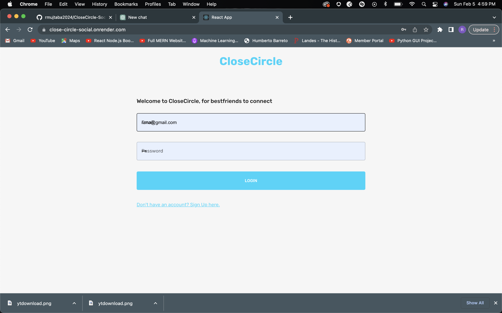

<h2> Close-Circle </h2>

<h4> MongoDB, Node.js, React, Express </h4>

This project is a full-stack social media application that I built. The front-end of the app is built using React. To make navigation easy and smooth, I used React-Router. I also used Formik and Yup for form validation to make sure that all the data entered into the app is accurate and in the right format.

To manage the state of the app, I used Redux Toolkit. And to make sure that users can access their data even when they're offline, I used Redux-Persist to store data in local storage.

The back-end of the app is built using Node.js and Express, and I used Mongoose to manage the MongoDB database where all the data for the app is stored. To make sure that only authorized users can access the app, I used Json Web Token for authentication. And for file upload, I used Multer, allowing users to upload images and other files to the app. The back-end code is saved in a separate repository.

