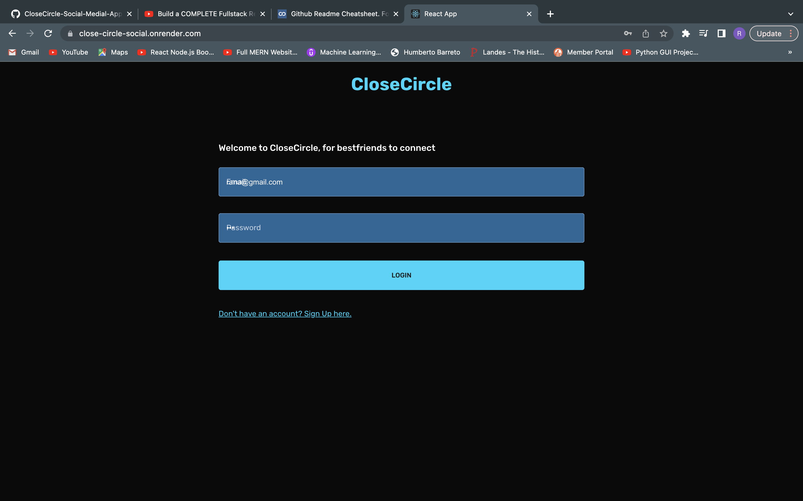
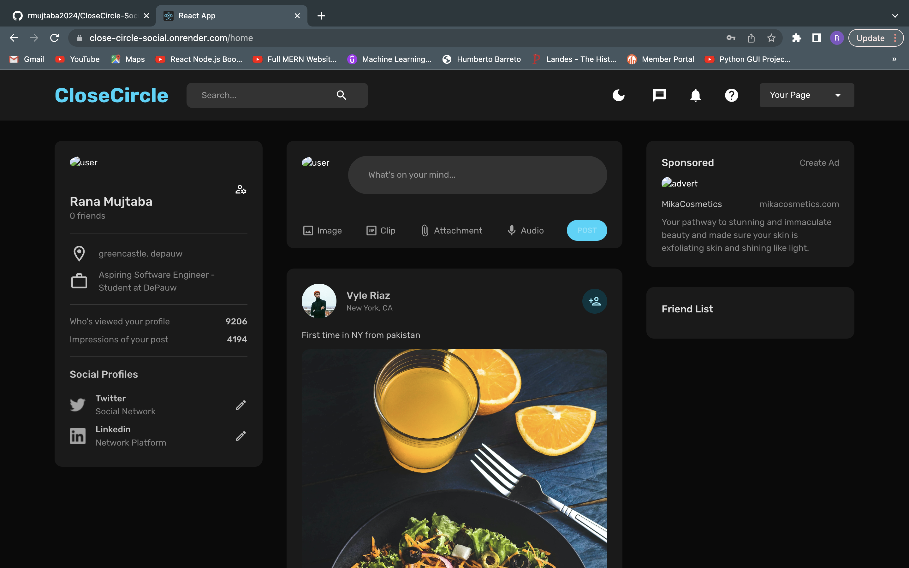

<h2> Close-Circle </h2>
<h4> Full-Stack MERN Application </h4>

The project is a full-stack social media application built using the MERN stack. The front-end of the application is built using React, a popular JavaScript library for building user interfaces. React-Router is used for navigation within the application, allowing for seamless navigation between different pages. Formik and Yup are used for form validation, ensuring that all data entered into the application is accurate and in the proper format.

State management is handled using Redux Toolkit, a powerful library that simplifies the use of Redux in React applications. Additionally, Redux-Persist is used to store files in local storage, allowing users to access their data even when they're offline.

On the back-end, the application is built using Node.js and Express. Mongoose is used to manage the MongoDB database, which stores all the data for the application. Json Web Token is used for authentication, ensuring that only authorized users can access the application. Finally, Multer is used for file upload, allowing users to upload images and other files to the application.
The back end is saved on another repo.

In summary, the MERN stack provides a comprehensive and powerful solution for building full-stack web applications, and this social media application is a great example of what can be achieved using this technology.

